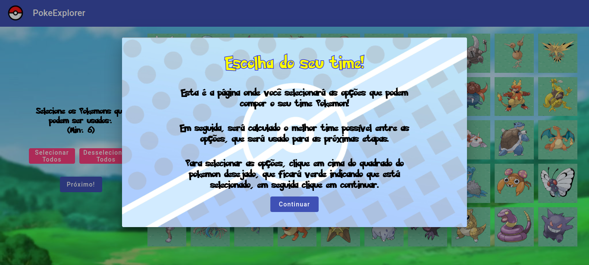
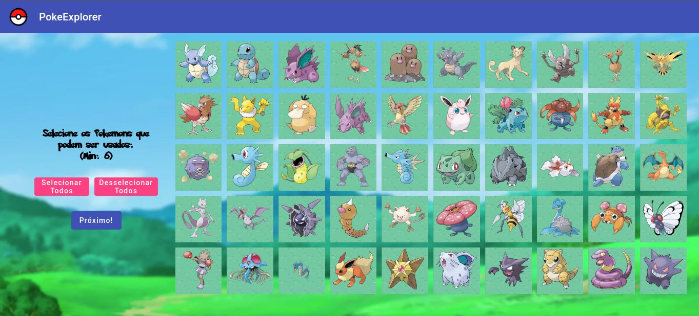
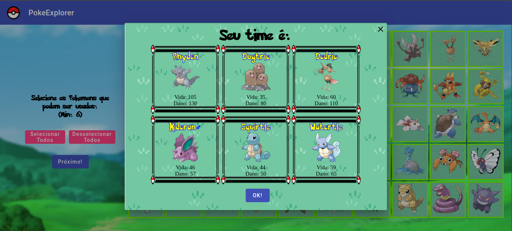
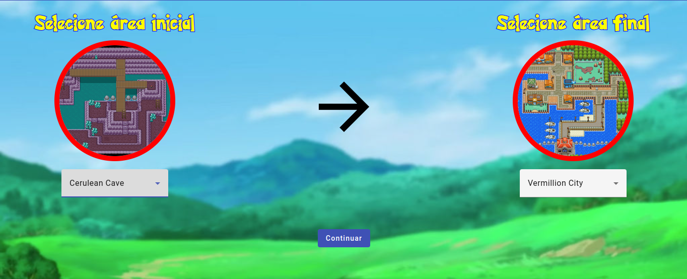

# PokeExplorer

**Número da Lista**: Não se aplica<br>
**Conteúdo da Disciplina**: Trabalho Final<br>

## Alunos
|Matrícula | Aluno |
| -- | -- |
| 19/0010606 | Artur de Sousa Vieira |
| 18/0145363 |  Yan Andrade de Sena  |

## Sobre 
O PokeExplorer é uma aplicação web que mostra o caminho mais fácil entre duas cidades na area ficcional de Kanto. 
Para isso, é feito o seguinte passo a passo, após ser selecionado as opçãos possiveis do time do usuário, o algoritmo, 
utilizando o algoritmo da mochila, calcula o melhor time entre as opções possíveis, o mesmo é feito para os times dos inimigos, 
em que é aplicado o algoritmo da mochila em 20 pokemons aleatórios entre todos os possíveis. Assim, é calculado a diferença entre o time 
do usuário e dos inimigos, baseando-se no dano, e é setado para cada aresta de um grafo com todas as cidades de Kanto, a dificuldade 
baseada na diferença do dano. Por fim, o algoritmo calcula, usando o Algoritmo Dijkstra, qual o caminho mais fácil.

## Screenshots

### Pagina inicial 

 

### Modal de instruções

 

### Seleção de pokemon

 

### Modal Melhor Time

 


### Seleção de área

 


### Resultado Final

 

 

## Instalação 
**Linguagem**: Java, Typescript<br>
**Framework**: Springboot, Angular<br>

Para rodar o nosso projeto localmente, deverá ter instalado Java (versão 11), Node (versão 16) e Maven(Versão 3.8). Também sugerimos a instalação de uma IDE, o Intellij, já que o mesmo facilita rodar projetos Java.

Para rodar o backend (sem IDE) basta acessar o diretório pokegraph_backend e rodar o comando:

```
mvn spring-boot:run 
```

Para rodar o backend (com a IDE) instalada basta apertar o botão "▶" no método main da classe ``br.com.pokeexplorer.PokeExplorerApplication``.

Para rodar o frontend basta ir no diretório pokegraph_frontend e rodar o comando:

```
npm i 
```

Para baixar as dependências e em seguida execute o comando:

```
npm run start
```

A aplicação estará disponível no endereço:

```
http://localhost:4200
```

## Uso 
Na Página inicial Clique em "Começar".

Em seguida, selecione, clicando em cima do quadrado do pokemon desejado, todas as opções que poderão ser usadas na seleção do melhor time. Então clique em "Próximo".

Na tela de Área, clique na caixa de selação e em seguida clique na opção desejada para área inicial e repita o processo para a área final. Em seguida clique em "Continuar"


## Outros

### Download Apresentação

Segue o Link para download da [Apresentação do projeto](assets-readme/entrega-pokeexplorer.mp4).<br>
(Para download, clique no link e depois nas opções *Download* ou *View Raw*)
