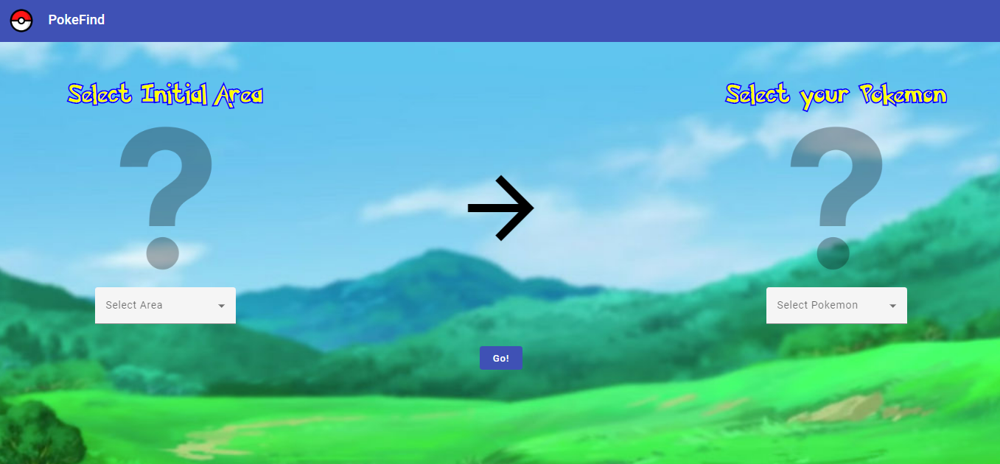
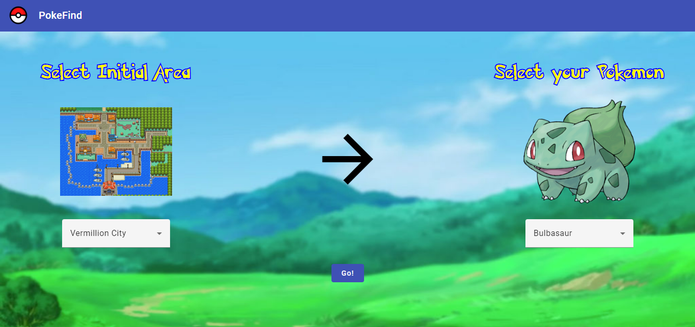
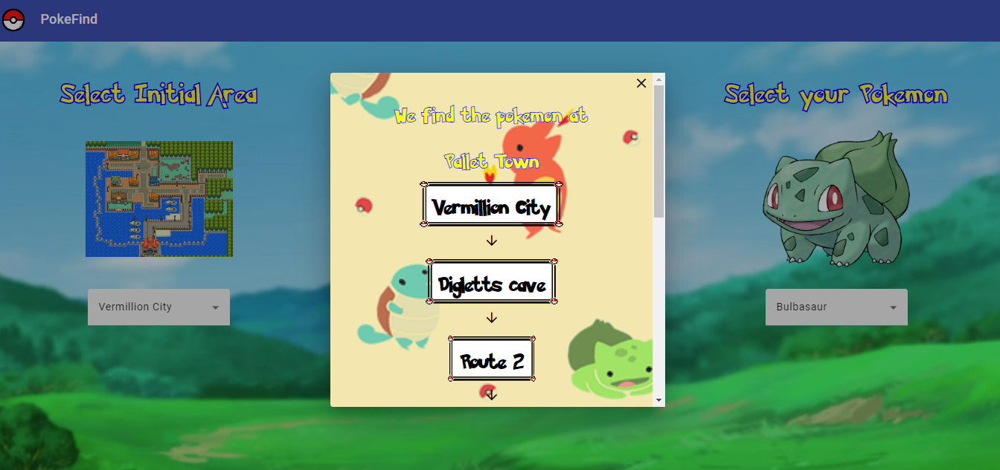
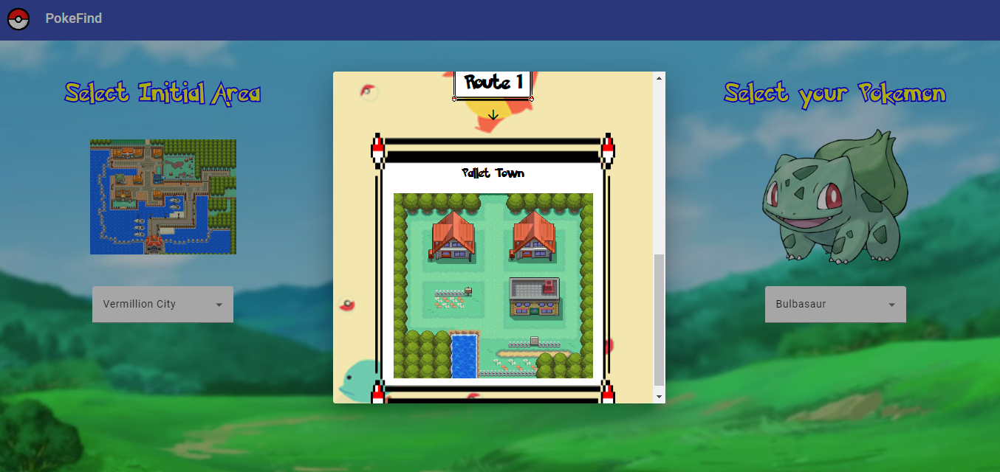

# PokeExplorer

**Número da Lista**: Não se aplica<br>
**Conteúdo da Disciplina**: Trabalho Final<br>

## Alunos
|Matrícula | Aluno |
| -- | -- |
| 19/0010606 | Artur de Sousa Vieira |
| 18/0145363 |  Yan Andrade de Sena  |

## Sobre 
O objetivo do PokeExplorer é apresentar uma interface direta e simples de utilizar, que tem a função de mostrar o lugar onde o pokemon foi encontrado. Para isso é utilizado o algoritmo de djikstra e estrutura de Grafos com arestas com pesos, onde estabelece a difculdade ou facilidade de acesso as rotas, cidades e outros lugares. 

## Grafo Utilizado


## Screenshots

### Pagina inicial (Sem Seleção)

 

### Pagina inicial (Area e Pokemon Selecionados)

 

### Modal de caminho

 
 

## Instalação 
**Linguagem**: Java, Typescript<br>
**Framework**: Springboot, Angular<br>

Para rodar o nosso projeto localmente, deverá ter instalado Java (versão 11), Node (versão 16) e Maven(Versão 3.8). Também sugerimos a instalação de uma IDE, o Intellij, já que o mesmo facilita rodar projetos Java.

Para rodar o backend (sem IDE) basta acessar o diretório pokegraph_backend e rodar o comando:

```
mvn spring-boot:run 
```

Para rodar o backend (com a IDE) instalada basta apertar o botão "▶" no método main da classe ``br.com.pokeexplorer.PokeExplorerApplication``.

Para rodar o frontend basta ir no diretório pokegraph_frontend e rodar o comando:

```
npm i 
```

Para baixar as dependências e em seguida execute o comando:

```
npm run start
```

A aplicação estará disponível no endereço:

```
http://localhost:4200
```

## Uso 
Para a utilizaçao devemos selecionar a área inicial da busca e o pokemon procurado e em seguida apertar o botão: ``"Go!"``.

## Outros

### Download Apresentação

Segue o Link para download da [Apresentação do projeto](assets-readme/apresentacao-pokefind.mp4).<br>
(Para download, clique no link e depois nas opções *Download* ou *View Raw*)
